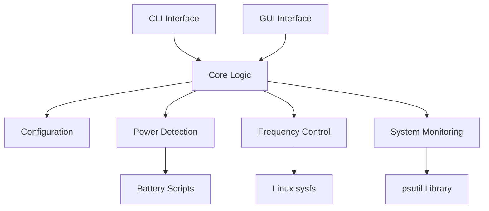

## Overview

auto-cpufreq is a Python-based daemon that manages Linux CPU frequency scaling. It's designed to be lightweight, efficient, and easy to extend.

## High-Level Architecture



## Project Structure

### Entry Points

Two main entry points defined in `pyproject.toml`:

```toml
[tool.poetry.scripts]
auto-cpufreq = "auto_cpufreq.bin.auto_cpufreq:main"
auto-cpufreq-gtk = "auto_cpufreq.bin.auto_cpufreq_gtk:main"
```

**CLI Entry Point** (`auto_cpufreq/bin/auto_cpufreq.py`):
- Uses Click for argument parsing
- Dispatches to different modes (monitor, live, daemon, etc.)
- Handles installation and removal

**GUI Entry Point** (`auto_cpufreq/bin/auto_cpufreq_gtk.py`):
- GTK-based graphical interface
- Optional dependency (PyGObject)
- Provides visual monitoring and daemon control

### Core Module

**`auto_cpufreq/core.py`** - The heart of the application

Key responsibilities:
- Main decision-making algorithm (`set_autofreq()`)
- Governor switching (`set_powersave()`, `set_performance()`)
- Turbo boost management (`turbo()`)
- System state monitoring
- Load threshold calculations

```python
# Main decision loop
def set_autofreq():
    """
    Main function for automatic CPU frequency scaling.
    Called continuously in daemon mode.
    """
    load1m = psutil.getloadavg()[0]
    
    if charging():
        # AC power logic
        if load1m > performance_load_threshold:
            set_performance()
        else:
            set_balanced()
    else:
        # Battery logic
        set_powersave()
        turbo(False)
```

### Configuration Module

**`auto_cpufreq/config/`** - Configuration file handling

- **`config.py`**: INI file parser and validator
- **`config_event_handler.py`**: File watcher for live config reload

Configuration precedence:
1. Command-line `--config` flag
2. `$XDG_CONFIG_HOME/auto-cpufreq/auto-cpufreq.conf`
3. `/etc/auto-cpufreq.conf`

```python
class Config:
    def get_charger_governor(self):
        """Get governor from [charger] section"""
        try:
            return self.config.get("charger", "governor")
        except:
            return "performance"  # Default
```

### Battery Scripts Module

**`auto_cpufreq/battery_scripts/`** - Device-specific battery management

- **`battery.py`**: Main battery threshold logic
- **`asus.py`**: ASUS laptop support (asus_wmi)
- **`ideapad_laptop.py`**: Lenovo IdeaPad support
- **`shared.py`**: Common battery functions

Each script handles:
- Device detection
- Threshold configuration
- Conservation mode (IdeaPad)

```python
# Example from battery.py
def set_battery_threshold(start, stop, device="BAT0"):
    """Set charging thresholds via sysfs"""
    base_path = f"/sys/class/power_supply/{device}"
    
    with open(f"{base_path}/charge_start_threshold", "w") as f:
        f.write(str(start))
    with open(f"{base_path}/charge_stop_threshold", "w") as f:
        f.write(str(stop))
```

### System Monitoring Module

**`auto_cpufreq/modules/`** - System information and monitoring

- **`system_info.py`**: Collects CPU, battery, temperature data
- **`system_monitor.py`**: TUI (Text User Interface) using urwid

Provides:
- Real-time system stats display
- CPU frequency monitoring
- Temperature readings
- Battery state
- Suggestion mode (what changes would be made)

```python
class SystemMonitor:
    def __init__(self, suggestion=False, type=ViewType.MONITOR):
        self.suggestion = suggestion  # Monitor vs live mode
        self.type = type
        # Set up urwid TUI
```

### GUI Module (Optional)

**`auto_cpufreq/gui/`** - GTK graphical interface

- **`app.py`**: Main application window
- **`objects.py`**: Custom GTK widgets
- **`tray.py`**: System tray icon support

Requires PyGObject (python3-gi). Only installed with `--extras gui`.

### Power Helper Module

**`auto_cpufreq/power_helper.py`** - Power management utilities

Functions:
- `charging()`: Detect AC vs battery power
- `gnome_power_detect()`: Check for GNOME Power Profiles daemon
- `tlp_service_detect()`: Detect TLP conflicts
- `bluetooth_disable()`, `bluetooth_enable()`: Bluetooth management

```python
def charging():
    """Determine if system is plugged into AC power"""
    for supply in os.listdir(POWER_SUPPLY_DIR):
        type_path = os.path.join(POWER_SUPPLY_DIR, supply, 'type')
        if os.path.exists(type_path):
            with open(type_path) as f:
                if f.read().strip() == 'Mains':
                    status_path = os.path.join(POWER_SUPPLY_DIR, supply, 'online')
                    with open(status_path) as f:
                        return f.read().strip() == '1'
    return False
```

### Globals Module

**`auto_cpufreq/globals.py`** - Constants and global state

```python
# Installation detection
IS_INSTALLED_WITH_SNAP = os.getenv('SNAP', None) is not None
IS_INSTALLED_WITH_AUR = Path("/usr/lib/auto-cpufreq").exists()

# CPU governors
ALL_GOVERNORS = ["performance", "powersave", "schedutil", "ondemand", "conservative"]
AVAILABLE_GOVERNORS = []  # Populated at runtime

# Paths
POWER_SUPPLY_DIR = "/sys/class/power_supply"
GITHUB = "https://github.com/AdnanHodzic/auto-cpufreq"
```

## Data Flow

### Daemon Mode Flow

```
1. systemd starts auto-cpufreq.service
   ↓
2. auto_cpufreq.py --daemon is executed
   ↓
3. Initialization:
   - Load configuration file
   - Detect conflicting services
   - Start config file watcher
   ↓
4. Main loop (runs continuously):
   a. Collect system state:
      - Battery charging status
      - CPU load average
      - CPU temperature
      - Current governor and frequency
   b. Decision making:
      - Check config overrides
      - Apply load/temperature thresholds
      - Determine target governor
      - Decide turbo boost state
   c. Apply changes:
      - Write to sysfs (governor, frequency limits)
      - Enable/disable turbo
      - Set EPP/EPB if configured
   d. Write stats file
   e. Sleep 1 second
   f. Repeat from step 4a
```

### Monitor Mode Flow

```
1. User runs: sudo auto-cpufreq --monitor
   ↓
2. Create SystemMonitor with suggestion=True
   ↓
3. Display loop:
   a. Collect current system state
   b. Show what WOULD be changed (no actual changes)
   c. Update display every second
   d. Highlight suggestions in yellow
   ↓
4. User exits (Ctrl+C or Q)
   - Clean exit, no changes persisted
```

### Live Mode Flow

```
1. User runs: sudo auto-cpufreq --live
   ↓
2. Suspend conflicting services temporarily:
   - GNOME Power Profiles daemon
   - TuneD daemon
   ↓
3. Background thread starts daemon loop (same as daemon mode)
   ↓
4. Foreground: Display SystemMonitor
   - Shows current optimizations
   - Real-time stats
   ↓
5. User exits:
   - Stop daemon thread
   - Restore original settings
   - Restart suspended services
```

## Linux Kernel Integration

### sysfs Interfaces

auto-cpufreq interacts with the Linux kernel via sysfs:

```
/sys/devices/system/cpu/
├── cpu0/
│   ├── cpufreq/
│   │   ├── scaling_governor          (read/write)
│   │   ├── scaling_min_freq          (read/write)
│   │   ├── scaling_max_freq          (read/write)
│   │   ├── scaling_cur_freq          (read only)
│   │   ├── scaling_available_governors (read only)
│   │   └── energy_performance_preference (read/write)
├── cpu1/, cpu2/, ...
├── intel_pstate/               (Intel CPUs)
│   ├── no_turbo                  (0=turbo on, 1=turbo off)
│   └── status
└── cpufreq/                    (AMD CPUs)
    └── boost                     (1=turbo on, 0=turbo off)
```

Example sysfs write:

```python
def set_governor(governor, cpu_num):
    path = f"/sys/devices/system/cpu/cpu{cpu_num}/cpufreq/scaling_governor"
    try:
        with open(path, "w") as f:
            f.write(governor)
    except IOError as e:
        print(f"Error setting governor for CPU {cpu_num}: {e}")
```

### systemd Integration

Daemon runs as a systemd service:

```ini
# /etc/systemd/system/auto-cpufreq.service
[Unit]
Description=auto-cpufreq - Automatic CPU speed & power optimizer
After=network.target

[Service]
Type=simple
ExecStart=/usr/local/bin/auto-cpufreq --daemon
Restart=on-failure

[Install]
WantedBy=multi-user.target
```

## Design Principles

### 1. Simplicity

- Minimal configuration required
- Sensible defaults work for most users
- Clear, readable code

### 2. Safety

- Never modify BIOS/firmware settings
- All changes are reversible
- Graceful degradation if features unavailable
- Extensive error handling

### 3. Performance

- Lightweight daemon (low CPU/memory usage)
- Fast decision-making loop (1-second interval)
- Minimal disk I/O

### 4. Compatibility

- Works with different CPU vendors (Intel, AMD, ARM)
- Supports various governors and drivers
- Multiple installation methods
- Distribution-agnostic

### 5. Extensibility

- Modular architecture
- Easy to add new battery devices
- Configuration file for customization
- Plugin-like battery scripts

## Key Design Decisions

### Why Python?

- Cross-distribution compatibility
- Rich libraries (psutil, click, pyinotify)
- Easy to read and contribute to
- Good performance for this use case

### Why Direct sysfs Access?

- No external dependencies
- Maximum compatibility
- Fastest method
- Works even if other tools conflict

### Why Not Use Existing Tools?

- **TLP**: Too complex, can lose turbo boost, manual intervention needed
- **cpufreq utils**: Require manual governor switching
- **GNOME Power Profiles**: Too simple, conflicts with fine-grained control

auto-cpufreq aims for the sweet spot: automatic and intelligent, but configurable.

## Extension Points

Areas designed for easy extension:

### 1. Battery Device Support

Add new file in `battery_scripts/`:

```python
# battery_scripts/mydevice.py
def is_device_supported():
    """Check if this device is present"""
    return os.path.exists("/sys/class/power_supply/...")

def set_threshold(start, stop):
    """Set charging thresholds"""
    # Device-specific implementation
    pass
```

### 2. Configuration Parameters

Add new config options in `config/config.py`:

```python
def get_my_parameter(self, section):
    if self.has_config():
        return self.config.get(section, "my_parameter", fallback="default")
    return "default"
```

### 3. CLI Commands

Add new commands in `bin/auto_cpufreq.py`:

```python
@click.option("--my-command", is_flag=True, help="My new command")
def main(..., my_command):
    if my_command:
        do_something()
```

## Testing Strategy

Current testing approach:

1. **Manual testing**: Primary method, using --monitor and --live modes
2. **Debug mode**: Extensive logging with --debug flag
3. **Real hardware**: Testing on various CPUs and distributions
4. **Community testing**: Beta testing through GitHub and Discord

Future considerations:
- Unit tests for core logic
- Integration tests for sysfs interaction (mocked)
- CI/CD for automated testing

## Related Topics

<CardGroup cols={2}>
  <Card title="Development Setup" icon="code" href="/development/setup">
    Set up your development environment
  </Card>
  <Card title="Contributing" icon="code-pull-request" href="/development/contributing">
    Learn how to contribute code
  </Card>
  <Card title="How It Works" icon="gears" href="/advanced/how-it-works">
    Deep dive into the decision-making algorithm
  </Card>
  <Card title="GitHub" icon="github" href="https://github.com/AdnanHodzic/auto-cpufreq">
    Browse the source code
  </Card>
</CardGroup>